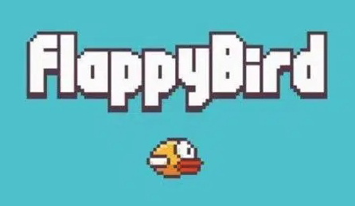

# Flappy Bird Clone

## Summary
Flappy Bird Clone is a browser game written in Javascript using the p5.js library.

[Click here to try it out!](https://joelchanzhiyang.github.io/FlappyBirdClone/)

## Origin

Flappy Bird was originally a popular mobile phone game developed by game development company dotGears. Due to a myriad of reasons, Flappy Bird was removed from the App Store and the Google Play Store. However, due to its huge popularity, many similar games have been developed in its absence. 

## The Goal

This project aims to copy as many features from the original Flappy Bird as possible. 

## Features

#### 1. Infinite generating game space

Pipes are generated every 1.5 seconds with the native JavaScript function [*setInterval()*](https://javascript.info/settimeout-setinterval). Pipes are automatically deleted from memory once they leave the screen. Hence, at any point in time, there will only be a maximum of 3 pipes in memory.

The moving ground is made by having two identical images of the ground aligned with each other moving to the left at the same speed as the pipes. When one of the images leave the left side of the canvas, it is teleported to right and aligned with the other image. As such, only two images are stored in memory at any point in time. 

#### 2. Pipe with bird collision detection

Pipe collision was implemented using an alogorithm that can detect a collision between a circle and a rectangle. This algorithm is learned from [Jeffery Thompson](http://www.jeffreythompson.org/collision-detection/circle-rect.php) from his excellent site with a interactive demonstration written in Processing.

#### 3. Using spacebar to interact with the game

Bird interaction was implemented with the p5.js function [*keyPressed()*](https://p5js.org/reference/#/p5/keyPressed). When the spacebar is pressed, the bird will immediately have a fixed upwards velocity. The constant acceleration downwards will cause the bird to move in an arc.

#### 4. End screen and game reset

A function was implemented that resets all the necessary variables to their starting condition, allowing for the user to reset the game without refreshing the page. A reset button to trigger the function will appear once the game has been lost. 

#### 5. Highscore Storage

Highscores are stored in local storage of the browser allowing the game to retrieve the highscore of previous attempts. Highscore is displayed once the game has ended. 

## Built With
* [JavaScript](https://www.javascript.com/)
* [p5.js Library](https://p5js.org/)

## Contributing
If you have found any bugs or have a feature to suggest, I can be contacted at joelchanzhiyang@gmail.com.

## Authors and Acknowledgements

All code was written by me. 

The pipes and the bird were designed by me, but heavily influenced by the original Flappy Bird game. 

The background was found [here](https://www.pinterest.com/pin/303430093618641114/) and was not designed by me.

Font is call "Back to 1982" and it can be found [here](https://www.dafont.com/back-to-1982.font).

